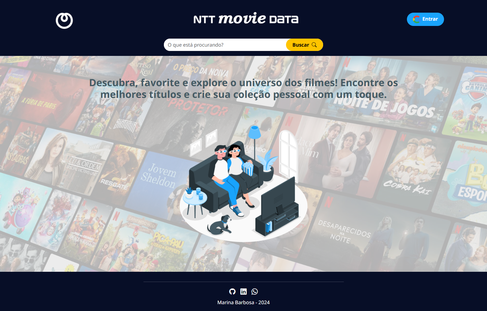
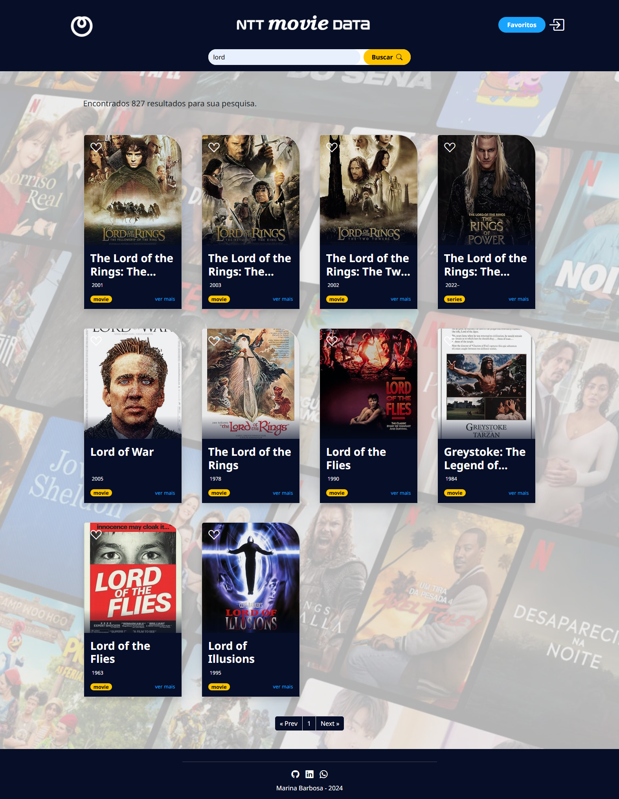
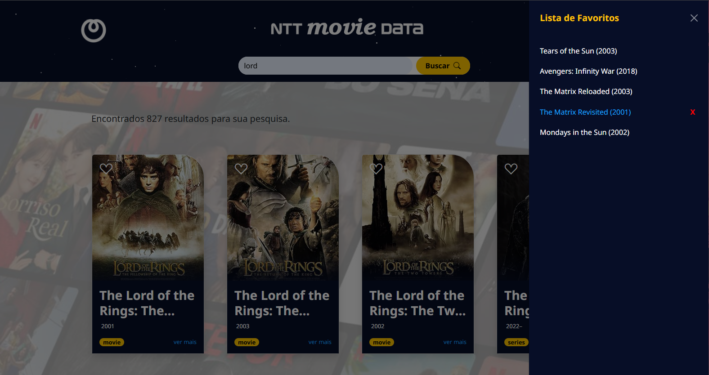
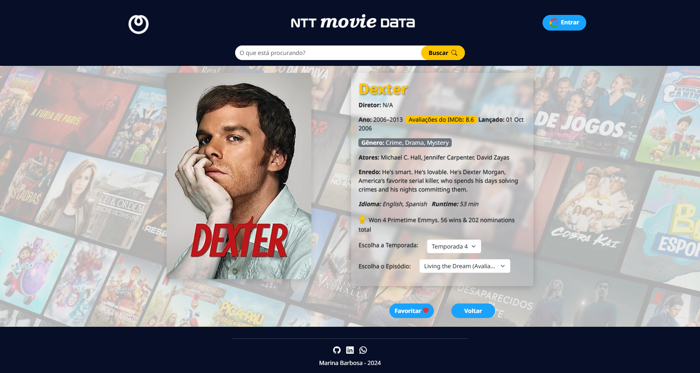

# ntt movie data

## Demo
https://nttmoviedata.netlify.app/

## Descrição
Aplicação SPA (Single Page Application) desenvolvida como teste de Front-End. Permite a busca de informações detalhadas sobre títulos de filmes, possibilitando também a visualização de temporadas e episódios de séries, além de marcar títulos favoritos. 

## Tecnologias
- Angular
- Bootstrap
- SCSS
- Firebase Store
- Login Google

## APIs Utilizadas
- [OMDb API](https://www.omdbapi.com/) - Informações sobre filmes e séries.
- [MyMemory API](https://mymemory.translated.net/) - Traduções automáticas de títulos e descrições.

## Dependências Principais

| Dependência                | Versão  |
|----------------------------|---------|
| @angular/animations        | ^18.2.0 |
| @angular/common            | ^18.2.0 |
| @angular/compiler          | ^18.2.0 |
| @angular/core              | ^18.2.0 |
| @angular/fire              | ^18.0.1 |
| @angular/forms             | ^18.2.0 |
| @angular/platform-browser  | ^18.2.0 |
| @angular/platform-browser-dynamic | ^18.2.0 |
| @angular/router            | ^18.2.0 |
| bootstrap                  | ^5.3.3  |
| bootstrap-icons            | ^1.11.3 |
| firebase                   | ^10.14.1|
| rxjs                       | ~7.8.0  |
| tslib                      | ^2.3.0  |
| zone.js                    | ~0.14.10|

## Estrutura do Projeto
```
src
├── components
├── containers
├── layout
├── service
│   └── api
└── environments
```

## Executando o Projeto

### Pré-requisitos
- Node.js e npm instalados
- Angular CLI instalado globalmente

### Passos
1. Clone o repositório:
   ```bash
   git clone git@github.com:marina-barbosa/ntt-movie-data.git
   ```
2. Navegue até a pasta do projeto:
   ```bash
   cd ntt-movie-data
   ```
3. Instale as dependências:
   ```bash
   npm install
   ```
4. Inicie o servidor de desenvolvimento:
   ```bash
   ng serve --open
   ```
5. Abra o navegador e acesse `http://localhost:4200`.

## Capturas de Tela
| Página      | Descrição                                     |
|-------------|----------------------------------------------|
| Home        | Exibe filmes populares e permite busca       |
| Details     | Exibe detalhes de um título específico       |
| Favoritos   | Lista de filmes e séries salvos como favoritos |
| Season      | Exibe temporadas de uma série                |
| Episode     | Exibe detalhes de um episódio                |











Aqui está uma seção de **Próximas Funcionalidades** que você pode adicionar ao `README.md`:

---

## Próximas Funcionalidades

As seguintes melhorias estão planejadas para futuras versões do projeto:

- [ ] **Melhoria na aparência da lista de favoritos:** Tornar a exibição dos itens favoritos mais atrativa.
- [ ] **Adicionar tipo de item na lista de favoritos:** Exibir o tipo (filme, série, episodio) ao lado do título na lista de favoritos para facilitar a identificação.
- [ ] **Botão de acesso ao trailer no card de detalhes:** Incluir um botão na página de detalhes que leva o usuário diretamente ao trailer do item.
- [ ] **Nova página para visualização de favoritos detalhada:** Criar uma página dedicada para exibir os favoritos com mais informações, opções de filtros e organização personalizada.
- [ ] **Adicionar comportamento para usuários logados**: Implementar funcionalidades específicas e ajustes de interface para usuários que estão autenticados.
- [ ] **Melhorar o serviço de tradução de texto**: Refinar o serviço de tradução para garantir mais precisão e suporte a múltiplos idiomas.
- [ ] **Revisão de acessibilidade**: Verificar e melhorar a acessibilidade para garantir uma experiência inclusiva para todos os usuários.
- [ ] **Componentizar a lista de favoritos**: Dividir a lista de favoritos em um componente reutilizável para facilitar a manutenção e uso em diferentes partes da aplicação.
- [ ] **Finalizar o componente `CardEpisode`**: Completar a implementação e ajustes de layout do card de episódios.
- [ ] **Adicionar SEO**: Implementar otimizações de SEO para melhorar a visibilidade do projeto nos mecanismos de busca.
- [ ] **Adicionar testes**: Criar testes unitários e de integração para melhorar a confiabilidade do projeto.
- [ ] **Atualizar o README**: Melhorar e expandir a documentação do README para descrever melhor o projeto, funcionalidades e instruções de uso.


---

Essas funcionalidades serão implementadas em versões futuras para oferecer uma experiência ainda mais completa aos usuários da aplicação.

